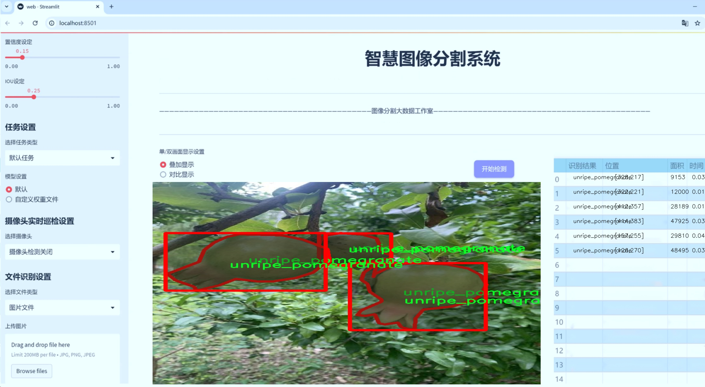
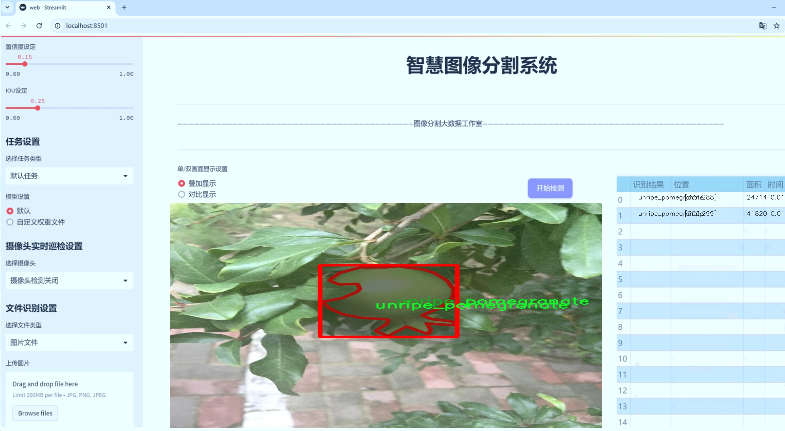
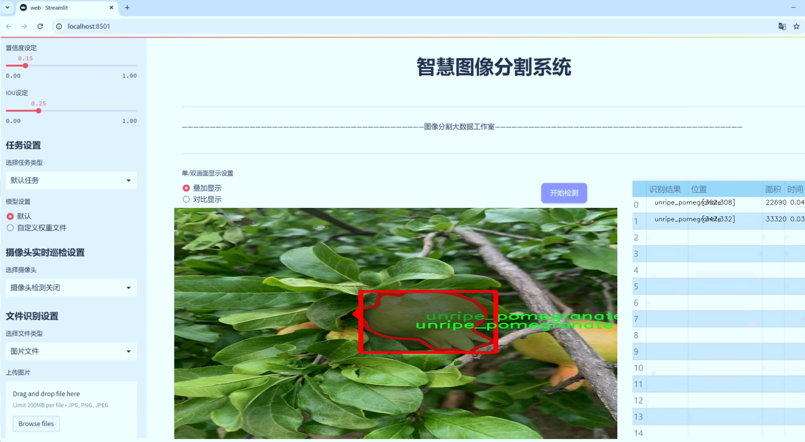
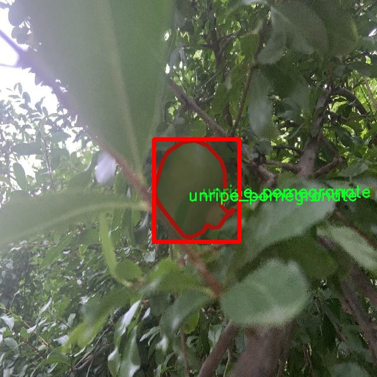
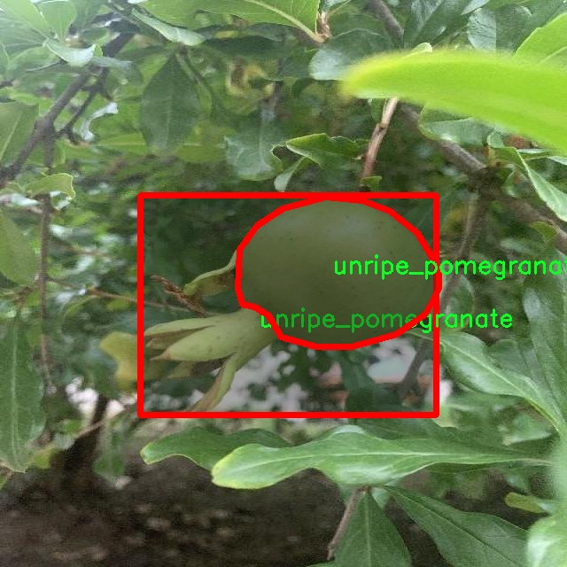
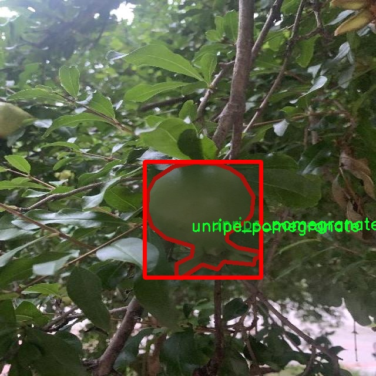
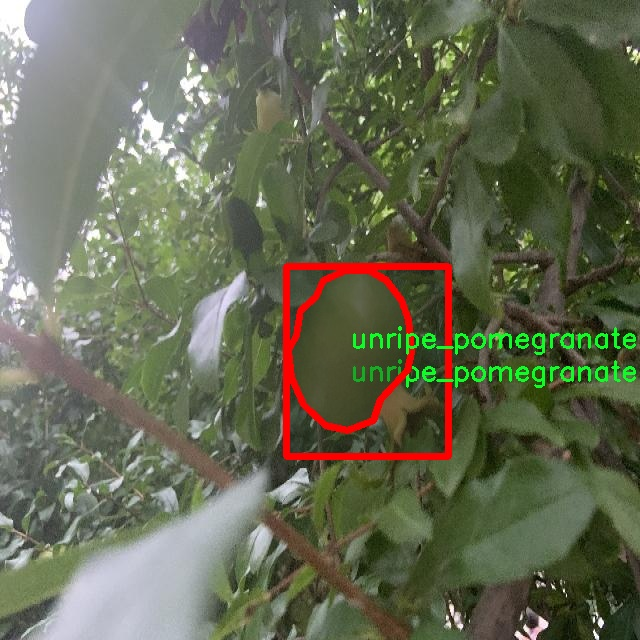
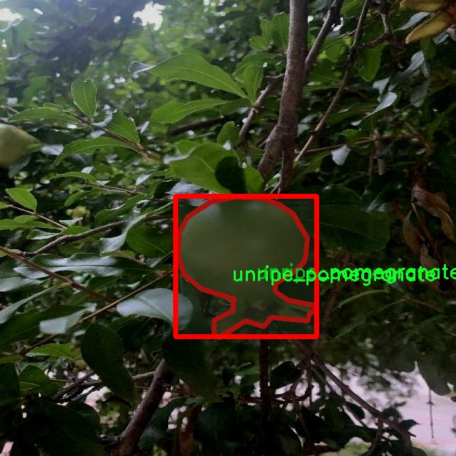

# 水果成熟度识别分割系统源码＆数据集分享
 [yolov8-seg-C2f-SCcConv＆yolov8-seg-C2f-ODConv等50+全套改进创新点发刊_一键训练教程_Web前端展示]

### 1.研究背景与意义

项目参考[ILSVRC ImageNet Large Scale Visual Recognition Challenge](https://gitee.com/YOLOv8_YOLOv11_Segmentation_Studio/projects)

项目来源[AAAI Global Al lnnovation Contest](https://kdocs.cn/l/cszuIiCKVNis)

研究背景与意义

随着全球人口的不断增长和生活水平的提高，水果作为一种重要的食品，其消费需求也日益增加。然而，水果的成熟度直接影响其口感、营养价值和市场价格，因此，准确识别水果的成熟度对于提高水果的市场竞争力、减少食品浪费以及保障消费者的健康具有重要意义。传统的水果成熟度识别方法主要依赖于人工观察和经验判断，这不仅耗时耗力，而且容易受到主观因素的影响，导致识别结果的不准确。因此，开发一种高效、准确的水果成熟度识别系统显得尤为重要。

近年来，计算机视觉和深度学习技术的快速发展为水果成熟度识别提供了新的解决方案。YOLO（You Only Look Once）系列模型因其高效的实时目标检测能力而受到广泛关注。YOLOv8作为该系列的最新版本，具备更强的特征提取能力和更高的检测精度，能够在复杂环境中实现快速而准确的目标识别。通过对YOLOv8进行改进，结合实例分割技术，可以实现对水果的精确识别和分割，从而为后续的成熟度分析提供更为可靠的数据支持。

本研究旨在基于改进的YOLOv8模型，构建一个水果成熟度识别分割系统。该系统将利用一个包含2400张图像的水果成熟度数据集，该数据集涵盖了12个类别的水果，包括生熟状态的芒果、葡萄、苹果、橙子和石榴等。这些类别的选择不仅反映了市场上常见水果的多样性，也为模型的训练和测试提供了丰富的样本。通过对不同成熟度水果的图像进行标注和分类，研究将能够深入分析不同成熟度水果的特征，从而提高模型的识别精度。

本研究的意义在于，不仅为水果成熟度的自动化识别提供了一种新的技术手段，还为农业生产、供应链管理和消费者服务等领域提供了重要的参考。通过实现水果成熟度的智能识别，可以帮助农民在最佳时机采摘水果，减少因过早或过晚采摘而造成的经济损失。同时，水果供应链中的各个环节也能够通过该系统提高效率，确保消费者能够获得新鲜、优质的水果。此外，该系统的成功应用还将推动智能农业的发展，促进农业与信息技术的深度融合，为实现可持续发展目标贡献力量。

综上所述，基于改进YOLOv8的水果成熟度识别分割系统的研究，不仅具有重要的理论价值，还有着广泛的实际应用前景。通过该研究，期望能够为水果产业的智能化转型提供新的思路和方法，推动农业现代化进程，为实现食品安全和可持续发展目标做出贡献。

### 2.图片演示







##### 注意：由于此博客编辑较早，上面“2.图片演示”和“3.视频演示”展示的系统图片或者视频可能为老版本，新版本在老版本的基础上升级如下：（实际效果以升级的新版本为准）

  （1）适配了YOLOV8的“目标检测”模型和“实例分割”模型，通过加载相应的权重（.pt）文件即可自适应加载模型。

  （2）支持“图片识别”、“视频识别”、“摄像头实时识别”三种识别模式。

  （3）支持“图片识别”、“视频识别”、“摄像头实时识别”三种识别结果保存导出，解决手动导出（容易卡顿出现爆内存）存在的问题，识别完自动保存结果并导出到tempDir中。

  （4）支持Web前端系统中的标题、背景图等自定义修改，后面提供修改教程。

  另外本项目提供训练的数据集和训练教程,暂不提供权重文件（best.pt）,需要您按照教程进行训练后实现图片演示和Web前端界面演示的效果。

### 3.视频演示

[3.1 视频演示](https://www.bilibili.com/video/BV1z72CYVEiy/)

### 4.数据集信息展示

##### 4.1 本项目数据集详细数据（类别数＆类别名）

nc: 12
names: ['Raw_Mango', 'Ripe_Mango', 'ripe grape', 'ripe_apple', 'ripe_orange', 'ripe_pomegranate', 'semiripe grape', 'semiripe_apple', 'unripe grape', 'unripe_apple', 'unripe_orange', 'unripe_pomegranate']


##### 4.2 本项目数据集信息介绍

数据集信息展示

在本研究中，我们采用了名为“fruits_weight”的数据集，以训练和改进YOLOv8-seg模型，用于水果成熟度的识别与分割。该数据集的设计旨在为计算机视觉任务提供丰富的样本，尤其是在水果成熟度的分类和分割方面。数据集包含12个类别，涵盖了从生鲜水果到成熟水果的不同阶段，具体类别包括：生芒果（Raw_Mango）、熟芒果（Ripe_Mango）、熟葡萄（ripe grape）、熟苹果（ripe_apple）、熟橙子（ripe_orange）、熟石榴（ripe_pomegranate）、半熟葡萄（semiripe grape）、半熟苹果（semiripe_apple）、未熟葡萄（unripe grape）、未熟苹果（unripe_apple）、未熟橙子（unripe_orange）和未熟石榴（unripe_pomegranate）。

数据集的丰富性和多样性使其成为训练水果成熟度识别模型的理想选择。每个类别的样本数量均衡，确保模型在训练过程中能够充分学习到每种水果在不同成熟度阶段的特征。通过这种方式，模型不仅能够识别水果的种类，还能准确判断其成熟度，从而为后续的水果质量评估和市场决策提供科学依据。

在数据集的构建过程中，样本的采集和标注经过严格的标准化流程。每个水果样本均经过专业人员的分类和标注，确保数据的准确性和可靠性。此外，数据集中还包含了不同环境和光照条件下的水果图像，这为模型的泛化能力提供了良好的基础。通过在多样化的场景中进行训练，YOLOv8-seg模型能够在实际应用中表现出更强的适应性和鲁棒性。

值得注意的是，数据集中的每个类别不仅仅代表了水果的成熟度状态，还隐含了不同的市场需求和消费偏好。例如，熟芒果和熟苹果通常在市场上更受欢迎，而未熟水果则可能需要进一步的存储和成熟处理。这种市场导向的设计理念使得数据集不仅具备学术研究的价值，也为实际商业应用提供了支持。

为了进一步提升模型的性能，我们还对数据集进行了数据增强处理，包括旋转、缩放、裁剪等操作。这些技术手段不仅增加了数据集的多样性，还有效提高了模型的鲁棒性，使其能够更好地应对现实世界中各种复杂的情况。

综上所述，“fruits_weight”数据集为改进YOLOv8-seg的水果成熟度识别分割系统提供了坚实的基础。通过对不同成熟度水果的全面覆盖，数据集不仅为模型的训练提供了丰富的样本，也为未来的研究和应用奠定了良好的基础。我们相信，随着该数据集的深入研究和应用，水果成熟度识别技术将在农业生产、食品安全和市场营销等领域发挥越来越重要的作用。











### 5.全套项目环境部署视频教程（零基础手把手教学）

[5.1 环境部署教程链接（零基础手把手教学）](https://www.bilibili.com/video/BV1jG4Ve4E9t/?vd_source=bc9aec86d164b67a7004b996143742dc)


[5.2 安装Python虚拟环境创建和依赖库安装视频教程链接（零基础手把手教学）](https://www.bilibili.com/video/BV1nA4VeYEze/?vd_source=bc9aec86d164b67a7004b996143742dc)

### 6.手把手YOLOV8-seg训练视频教程（零基础小白有手就能学会）

[6.1 手把手YOLOV8-seg训练视频教程（零基础小白有手就能学会）](https://www.bilibili.com/video/BV1cA4VeYETe/?vd_source=bc9aec86d164b67a7004b996143742dc)


按照上面的训练视频教程链接加载项目提供的数据集，运行train.py即可开始训练



     Epoch   gpu_mem       box       obj       cls    labels  img_size
     1/200     0G   0.01576   0.01955  0.007536        22      1280: 100%|██████████| 849/849 [14:42<00:00,  1.04s/it]
               Class     Images     Labels          P          R     mAP@.5 mAP@.5:.95: 100%|██████████| 213/213 [01:14<00:00,  2.87it/s]
                 all       3395      17314      0.994      0.957      0.0957      0.0843

     Epoch   gpu_mem       box       obj       cls    labels  img_size
     2/200     0G   0.01578   0.01923  0.007006        22      1280: 100%|██████████| 849/849 [14:44<00:00,  1.04s/it]
               Class     Images     Labels          P          R     mAP@.5 mAP@.5:.95: 100%|██████████| 213/213 [01:12<00:00,  2.95it/s]
                 all       3395      17314      0.996      0.956      0.0957      0.0845

     Epoch   gpu_mem       box       obj       cls    labels  img_size
     3/200     0G   0.01561    0.0191  0.006895        27      1280: 100%|██████████| 849/849 [10:56<00:00,  1.29it/s]
               Class     Images     Labels          P          R     mAP@.5 mAP@.5:.95: 100%|███████   | 187/213 [00:52<00:00,  4.04it/s]
                 all       3395      17314      0.996      0.957      0.0957      0.0845


### 7.50+种全套YOLOV8-seg创新点代码加载调参视频教程（一键加载写好的改进模型的配置文件）

[7.1 50+种全套YOLOV8-seg创新点代码加载调参视频教程（一键加载写好的改进模型的配置文件）](https://www.bilibili.com/video/BV1Hw4VePEXv/?vd_source=bc9aec86d164b67a7004b996143742dc)

### 8.YOLOV8-seg图像分割算法原理

原始YOLOv8-seg算法原理

YOLOv8-seg算法是YOLO系列中的一个重要版本，它在目标检测的基础上进一步扩展了图像分割的能力。YOLOv8-seg的设计理念是通过结合目标检测与图像分割的优点，提供更为精确的目标定位和更细致的目标形状信息。这一算法不仅继承了YOLO系列的高效性和实时性，还在复杂场景下展现出更强的适应性，尤其是在小目标和复杂背景的处理上。

首先，YOLOv8-seg的网络结构可以分为四个主要模块：输入端、主干网络、Neck端和输出端。输入端负责对输入图像进行预处理，采用了Mosaic数据增强、自适应图片缩放和灰度填充等技术，以提高模型对多样化数据的鲁棒性。这样的预处理不仅能够丰富训练数据，还能有效减少模型在真实场景中可能遇到的噪声干扰。

在主干网络中，YOLOv8-seg采用了深层卷积神经网络结构，通过Conv、C2f和SPPF等模块提取图像特征。C2f模块引入了双层路由注意力机制，这一设计旨在捕获远程依赖关系，保留特征提取过程中更细粒度的上下文信息。这样的特征提取方式，使得网络能够更好地理解图像中的空间关系，从而提高对小目标的感知能力。

Neck端则基于路径聚合网络（PAN）结构，通过上采样、下采样和特征拼接等操作，对不同尺度的特征图进行融合。这一过程使得YOLOv8-seg能够有效地整合来自不同层次的特征信息，增强模型对目标的检测和分割能力。特别是在处理小目标时，Neck端的设计显得尤为重要，因为小目标往往在特征图中表现得不够明显，融合多尺度特征能够有效提升其检测精度。

输出端采用了decoupled head结构，实现了分类和回归过程的解耦。这一设计的核心在于将目标的分类和定位任务分开处理，使得模型在执行时能够更专注于每个任务的优化。通过Task-Aligned Assigner方法，YOLOv8-seg能够对分类分数和回归分数进行加权匹配，从而提高正样本的匹配效率。此外，损失计算方面，YOLOv8-seg结合了BCE（binary cross-entropy）和DFL（distribution focal loss）等多种损失函数，以确保模型在训练过程中能够更好地收敛，提升最终的检测和分割精度。

在处理复杂水面环境时，YOLOv8-seg算法展现出了显著的优势。由于水面上漂浮物的特征复杂且背景多样，传统的目标检测算法往往难以准确定位目标。而YOLOv8-seg通过引入多尺度特征融合和更为细致的上下文信息捕获，能够有效减少定位误差，提升对小目标的感知能力。特别是在小目标漏检问题上，YOLOv8-seg通过添加更小的检测头和引入GSConv技术，显著增强了模型对小目标的检测能力。

此外，YOLOv8-seg还在损失函数的设计上进行了创新，采用了MPDIoU（Multi-Point Distance IoU）损失函数替代了传统的CIoU（Complete Intersection over Union）损失函数。这一改进不仅提高了模型的泛化能力，还在复杂场景下提升了检测的精准度。MPDIoU损失函数通过考虑多个关键点之间的距离关系，使得模型在训练过程中能够更好地学习目标的几何特征，从而在实际应用中表现出更高的准确性。

总的来说，YOLOv8-seg算法在YOLO系列的基础上进行了多方面的优化与改进，尤其是在小目标检测和复杂背景处理上展现出了优越的性能。其独特的网络结构设计、精细的特征提取机制以及创新的损失函数，使得YOLOv8-seg成为了一种强大的目标检测与分割工具，广泛适用于智能监控、自动驾驶、医疗影像分析等多个领域。随着技术的不断进步，YOLOv8-seg无疑将在未来的图像处理任务中发挥更为重要的作用。


### 9.系统功能展示（检测对象为举例，实际内容以本项目数据集为准）

图9.1.系统支持检测结果表格显示

  图9.2.系统支持置信度和IOU阈值手动调节

  图9.3.系统支持自定义加载权重文件best.pt(需要你通过步骤5中训练获得)

  图9.4.系统支持摄像头实时识别

  图9.5.系统支持图片识别

  图9.6.系统支持视频识别

  图9.7.系统支持识别结果文件自动保存

  图9.8.系统支持Excel导出检测结果数据


### 10.50+种全套YOLOV8-seg创新点原理讲解（非科班也可以轻松写刊发刊，V11版本正在科研待更新）

#### 10.1 由于篇幅限制，每个创新点的具体原理讲解就不一一展开，具体见下列网址中的创新点对应子项目的技术原理博客网址【Blog】：


[10.1 50+种全套YOLOV8-seg创新点原理讲解链接](https://gitee.com/qunmasj/good)

#### 10.2 部分改进模块原理讲解(完整的改进原理见上图和技术博客链接)【如果此小节的图加载失败可以通过CSDN或者Github搜索该博客的标题访问原始博客，原始博客图片显示正常】
### YOLOv8简介
#### Backbone


借鉴了其他算法的这些设计思想

借鉴了VGG的思想，使用了较多的3×3卷积，在每一次池化操作后，将通道数翻倍；

借鉴了network in network的思想，使用全局平均池化（global average pooling）做预测，并把1×1的卷积核置于3×3的卷积核之间，用来压缩特征；（我没找到这一步体现在哪里）

使用了批归一化层稳定模型训练，加速收敛，并且起到正则化作用。

    以上三点为Darknet19借鉴其他模型的点。Darknet53当然是在继承了Darknet19的这些优点的基础上再新增了下面这些优点的。因此列在了这里

借鉴了ResNet的思想，在网络中大量使用了残差连接，因此网络结构可以设计的很深，并且缓解了训练中梯度消失的问题，使得模型更容易收敛。

使用步长为2的卷积层代替池化层实现降采样。（这一点在经典的Darknet-53上是很明显的，output的长和宽从256降到128，再降低到64，一路降低到8，应该是通过步长为2的卷积层实现的；在YOLOv8的卷积层中也有体现，比如图中我标出的这些位置）

#### 特征融合

模型架构图如下

  Darknet-53的特点可以这样概括：（Conv卷积模块+Residual Block残差块）串行叠加4次

  Conv卷积层+Residual Block残差网络就被称为一个stage


上面红色指出的那个，原始的Darknet-53里面有一层 卷积，在YOLOv8里面，把一层卷积移除了

为什么移除呢？

        原始Darknet-53模型中间加的这个卷积层做了什么？滤波器（卷积核）的个数从 上一个卷积层的512个，先增加到1024个卷积核，然后下一层卷积的卷积核的个数又降低到512个

        移除掉这一层以后，少了1024个卷积核，就可以少做1024次卷积运算，同时也少了1024个3×3的卷积核的参数，也就是少了9×1024个参数需要拟合。这样可以大大减少了模型的参数，（相当于做了轻量化吧）

        移除掉这个卷积层，可能是因为作者发现移除掉这个卷积层以后，模型的score有所提升，所以才移除掉的。为什么移除掉以后，分数有所提高呢？可能是因为多了这些参数就容易，参数过多导致模型在训练集删过拟合，但是在测试集上表现很差，最终模型的分数比较低。你移除掉这个卷积层以后，参数减少了，过拟合现象不那么严重了，泛化能力增强了。当然这个是，拿着你做实验的结论，反过来再找补，再去强行解释这种现象的合理性。

过拟合


通过MMdetection官方绘制册这个图我们可以看到，进来的这张图片经过一个“Feature Pyramid Network(简称FPN)”，然后最后的P3、P4、P5传递给下一层的Neck和Head去做识别任务。 PAN（Path Aggregation Network）


“FPN是自顶向下，将高层的强语义特征传递下来。PAN就是在FPN的后面添加一个自底向上的金字塔，对FPN补充，将低层的强定位特征传递上去，

FPN是自顶（小尺寸，卷积次数多得到的结果，语义信息丰富）向下（大尺寸，卷积次数少得到的结果），将高层的强语义特征传递下来，对整个金字塔进行增强，不过只增强了语义信息，对定位信息没有传递。PAN就是针对这一点，在FPN的后面添加一个自底（卷积次数少，大尺寸）向上（卷积次数多，小尺寸，语义信息丰富）的金字塔，对FPN补充，将低层的强定位特征传递上去，又被称之为“双塔战术”。

FPN层自顶向下传达强语义特征，而特征金字塔则自底向上传达强定位特征，两两联手，从不同的主干层对不同的检测层进行参数聚合,这样的操作确实很皮。
#### 自底向上增强

而 PAN（Path Aggregation Network）是对 FPN 的一种改进，它的设计理念是在 FPN 后面添加一个自底向上的金字塔。PAN 引入了路径聚合的方式，通过将浅层特征图（低分辨率但语义信息较弱）和深层特征图（高分辨率但语义信息丰富）进行聚合，并沿着特定的路径传递特征信息，将低层的强定位特征传递上去。这样的操作能够进一步增强多尺度特征的表达能力，使得 PAN 在目标检测任务中表现更加优秀。


### 可重参化EfficientRepBiPAN优化Neck
#### Repvgg-style
Repvgg-style的卷积层包含
卷积+ReLU结构，该结构能够有效地利用硬件资源。

在训练时，Repvgg-style的卷积层包含
卷积、
卷积、identity。（下图左图）


在推理时，通过重参数化（re-parameterization），上述的多分支结构可以转换为单分支的
卷积。（下图右图）


基于上述思想，作者设计了对GPU硬件友好的EfficientRep Backbone和Rep-PAN Neck，将它们用于YOLOv6中。

EfficientRep Backbone的结构图：


Rep-PAN Neck结构图：


#### Multi-path
只使用repvgg-style不能达到很好的精度-速度平衡，对于大模型，作者探索了多路径的网络结构。

参考该博客提出了Bep unit，其结构如下图所示：


CSP（Cross Stage Partial）-style计算量小，且有丰富的梯度融合信息，广泛应用于YOLO系列中，比如YOLOv5、PPYOLOE。

作者将Bep unit与CSP-style结合，设计了一种新的网络结构BepC3，如下图所示：


基于BepC3模块，作者设计了新的CSPBep Backbone和CSPRepPAN Neck，以达到很好的精度-速度平衡。

其他YOLO系列在使用CSP-stype结构时，partial ratio设置为1/2。为了达到更好的性能，在YOLOv6m中partial ratio的值为2/3，在YOLOv6l中partial ratio的值为1/2。

对于YOLOv6m，单纯使用Rep-style结构和使用BepC3结构的对比如下图所示：

#### BIFPN
BiFPN 全称 Bidirectional Feature Pyramid Network 加权双向（自顶向下 + 自低向上）特征金字塔网络。

相比较于PANet，BiFPN在设计上的改变：

总结下图：
图d 蓝色部分为自顶向下的通路，传递的是高层特征的语义信息；红色部分是自底向上的通路，传递的是低层特征的位置信息；紫色部分是上述第二点提到的同一层在输入节点和输入节点间新加的一条边。


我们删除那些只有一条输入边的节点。这么做的思路很简单：如果一个节点只有一条输入边而没有特征融合，那么它对旨在融合不同特征的特征网络的贡献就会很小。删除它对我们的网络影响不大，同时简化了双向网络；如上图d 的 P7右边第一个节点

如果原始输入节点和输出节点处于同一层，我们会在原始输入节点和输出节点之间添加一条额外的边。思路：以在不增加太多成本的情况下融合更多的特性；

与只有一个自顶向下和一个自底向上路径的PANet不同，我们处理每个双向路径(自顶向下和自底而上)路径作为一个特征网络层，并重复同一层多次，以实现更高层次的特征融合。如下图EfficientNet 的网络结构所示，我们对BiFPN是重复使用多次的。而这个使用次数也不是我们认为设定的，而是作为参数一起加入网络的设计当中，使用NAS技术算出来的。


Weighted Feature Fusion 带权特征融合：学习不同输入特征的重要性，对不同输入特征有区分的融合。
设计思路：传统的特征融合往往只是简单的 feature map 叠加/相加 (sum them up)，比如使用concat或者shortcut连接，而不对同时加进来的 feature map 进行区分。然而，不同的输入 feature map 具有不同的分辨率，它们对融合输入 feature map 的贡献也是不同的，因此简单的对他们进行相加或叠加处理并不是最佳的操作。所以这里我们提出了一种简单而高效的加权特融合的机制。
常见的带权特征融合有三种方法，分别是：


​
  这种方法比较简单，直接加一个可学习的权重。但是由于这个权重不受限制，所有可能引起训练的不稳定，所有并不推荐。
Softmax-based fusion: O = ∑ i e w i ∗ I i ϵ + ∑ j e w j O = \sum_{i} \frac{e^{w_i} * I_i}{ \epsilon+\sum_{j}e^{w_j}}O=∑ 

 

​
  使用这种方法可以将范围放缩到 [ 0 , 1 ] [0, 1][0,1] 之间，训练稳定，但是训练很慢，所有也不推荐。
Fast normalized fusion: O = ∑ i w i ∗ I i ϵ + ∑ j w j O = \sum_{i} \frac{w_i * I_i}{ \epsilon+\sum_{j}w_j}O=∑ 


### 11.项目核心源码讲解（再也不用担心看不懂代码逻辑）

#### 11.1 ui.py

以下是经过精简和注释的核心代码：

```python
import sys
import subprocess
from QtFusion.path import abs_path

def run_script(script_path):
    """
    使用当前 Python 环境运行指定的脚本。

    Args:
        script_path (str): 要运行的脚本路径
    """
    # 获取当前 Python 解释器的路径
    python_path = sys.executable

    # 构建运行命令，使用 streamlit 运行指定的脚本
    command = f'"{python_path}" -m streamlit run "{script_path}"'

    # 执行命令并捕获结果
    result = subprocess.run(command, shell=True)
    
    # 检查命令执行是否成功
    if result.returncode != 0:
        print("脚本运行出错。")

# 主程序入口
if __name__ == "__main__":
    # 获取脚本的绝对路径
    script_path = abs_path("web.py")

    # 运行指定的脚本
    run_script(script_path)
```

### 代码注释说明：
1. **导入模块**：
   - `sys`：用于访问与 Python 解释器紧密相关的变量和函数。
   - `subprocess`：用于创建新进程、连接到它们的输入/输出/错误管道，并获得它们的返回码。
   - `abs_path`：从 `QtFusion.path` 导入的函数，用于获取文件的绝对路径。

2. **`run_script` 函数**：
   - 该函数接收一个脚本路径作为参数，并使用当前 Python 环境来运行该脚本。
   - 使用 `sys.executable` 获取当前 Python 解释器的路径。
   - 构建一个命令字符串，使用 `streamlit` 模块来运行指定的脚本。
   - 使用 `subprocess.run` 执行构建的命令，并检查返回码以确定脚本是否成功运行。

3. **主程序入口**：
   - 使用 `if __name__ == "__main__":` 确保只有在直接运行该脚本时才会执行以下代码。
   - 调用 `abs_path` 函数获取 `web.py` 脚本的绝对路径。
   - 调用 `run_script` 函数运行指定的脚本。

这个程序文件 `ui.py` 是一个用于运行 Python 脚本的简单工具，特别是用于运行 Streamlit 应用。首先，文件导入了必要的模块，包括 `sys`、`os` 和 `subprocess`，这些模块提供了与系统交互的功能。特别地，`sys` 模块用于获取当前 Python 解释器的路径，`subprocess` 模块用于在子进程中执行命令。

接下来，定义了一个名为 `run_script` 的函数，该函数接受一个参数 `script_path`，这是要运行的脚本的路径。函数内部首先获取当前 Python 解释器的路径，并使用这个路径构建一个命令字符串，命令的格式是通过 `streamlit` 模块运行指定的脚本。具体来说，命令会调用 Python 解释器并以模块的形式运行 `streamlit`，后面跟上要执行的脚本路径。

然后，使用 `subprocess.run` 方法执行构建好的命令。如果命令执行的返回码不为零，表示脚本运行过程中出现了错误，程序会打印出“脚本运行出错”的提示信息。

在文件的最后部分，使用 `if __name__ == "__main__":` 语句来确保只有在直接运行该脚本时才会执行后面的代码。这部分代码指定了要运行的脚本路径，这里是 `web.py`，并调用 `run_script` 函数来执行这个脚本。

总的来说，这个文件的主要功能是提供一个简单的接口，通过命令行运行一个 Streamlit 应用，方便用户在当前的 Python 环境中启动指定的脚本。

#### 11.2 ultralytics\utils\callbacks\raytune.py

以下是代码中最核心的部分，并附上详细的中文注释：

```python
# 导入必要的库和模块
from ultralytics.utils import SETTINGS

# 尝试导入Ray和相关模块，并检查Ray Tune集成是否启用
try:
    assert SETTINGS['raytune'] is True  # 验证Ray Tune集成是否启用
    import ray
    from ray import tune
    from ray.air import session
except (ImportError, AssertionError):
    tune = None  # 如果导入失败或集成未启用，则将tune设置为None

def on_fit_epoch_end(trainer):
    """在每个训练周期结束时，将训练指标发送到Ray Tune。"""
    if ray.tune.is_session_enabled():  # 检查Ray Tune会话是否启用
        metrics = trainer.metrics  # 获取当前训练指标
        metrics['epoch'] = trainer.epoch  # 将当前周期数添加到指标中
        session.report(metrics)  # 向Ray Tune报告指标

# 定义回调函数字典，如果tune可用，则包含on_fit_epoch_end回调
callbacks = {
    'on_fit_epoch_end': on_fit_epoch_end, 
} if tune else {}
```

### 代码注释说明：
1. **导入模块**：首先导入`SETTINGS`以获取配置，并尝试导入Ray及其相关模块。
2. **集成检查**：通过`assert`语句检查Ray Tune的集成是否被启用，如果未启用或导入失败，则将`tune`设置为`None`。
3. **定义回调函数**：`on_fit_epoch_end`函数在每个训练周期结束时被调用，用于将训练指标发送到Ray Tune。
4. **报告指标**：在函数内部，首先检查Ray Tune会话是否启用，如果启用，则获取当前的训练指标，并将当前周期数添加到指标中，最后通过`session.report`方法将这些指标报告给Ray Tune。
5. **回调字典**：根据`tune`的可用性，定义一个回调字典，其中包含`on_fit_epoch_end`回调函数。

这个程序文件是一个用于与Ray Tune集成的回调函数模块，主要用于在训练过程中收集和报告训练指标。首先，文件开头引入了Ultralytics库中的设置（SETTINGS），并检查Ray Tune的集成是否被启用。如果启用，则导入Ray及其tune模块和session模块；如果未启用，或者导入失败，则将tune设置为None。

接下来，定义了一个名为`on_fit_epoch_end`的函数，该函数在每个训练周期结束时被调用。函数的主要功能是将训练的指标发送到Ray Tune。具体来说，它首先检查Ray Tune的会话是否已启用。如果启用，函数会从训练器（trainer）中获取当前的训练指标，并将当前的训练周期（epoch）添加到指标中。然后，使用`session.report(metrics)`将这些指标报告给Ray Tune，以便进行后续的分析和调优。

最后，程序创建了一个名为`callbacks`的字典，如果tune不为None，则将`on_fit_epoch_end`函数添加到字典中。这个字典可以在训练过程中用于调用相应的回调函数，以便在训练的不同阶段执行特定的操作。整体来看，这段代码的目的是为了实现与Ray Tune的无缝集成，以便更好地监控和优化模型训练过程。

#### 11.3 ultralytics\models\yolo\pose\train.py

以下是代码中最核心的部分，并附上详细的中文注释：

```python
# 导入必要的库和模块
from copy import copy
from ultralytics.models import yolo
from ultralytics.nn.tasks import PoseModel
from ultralytics.utils import DEFAULT_CFG, LOGGER
from ultralytics.utils.plotting import plot_images, plot_results

class PoseTrainer(yolo.detect.DetectionTrainer):
    """
    PoseTrainer类，扩展了DetectionTrainer类，用于基于姿态模型的训练。
    """

    def __init__(self, cfg=DEFAULT_CFG, overrides=None, _callbacks=None):
        """初始化PoseTrainer对象，使用指定的配置和覆盖参数。"""
        if overrides is None:
            overrides = {}
        overrides['task'] = 'pose'  # 设置任务类型为姿态估计
        super().__init__(cfg, overrides, _callbacks)  # 调用父类的初始化方法

        # 检查设备类型，如果是Apple MPS，给出警告
        if isinstance(self.args.device, str) and self.args.device.lower() == 'mps':
            LOGGER.warning("WARNING ⚠️ Apple MPS known Pose bug. Recommend 'device=cpu' for Pose models. "
                           'See https://github.com/ultralytics/ultralytics/issues/4031.')

    def get_model(self, cfg=None, weights=None, verbose=True):
        """获取指定配置和权重的姿态估计模型。"""
        # 创建PoseModel实例
        model = PoseModel(cfg, ch=3, nc=self.data['nc'], data_kpt_shape=self.data['kpt_shape'], verbose=verbose)
        if weights:
            model.load(weights)  # 如果提供了权重，则加载权重

        return model  # 返回模型实例

    def set_model_attributes(self):
        """设置PoseModel的关键点形状属性。"""
        super().set_model_attributes()  # 调用父类的方法
        self.model.kpt_shape = self.data['kpt_shape']  # 设置关键点形状

    def get_validator(self):
        """返回PoseValidator类的实例，用于验证。"""
        self.loss_names = 'box_loss', 'pose_loss', 'kobj_loss', 'cls_loss', 'dfl_loss'  # 定义损失名称
        return yolo.pose.PoseValidator(self.test_loader, save_dir=self.save_dir, args=copy(self.args))  # 返回验证器实例

    def plot_training_samples(self, batch, ni):
        """绘制一批训练样本，包括标注的类别标签、边界框和关键点。"""
        images = batch['img']  # 获取图像
        kpts = batch['keypoints']  # 获取关键点
        cls = batch['cls'].squeeze(-1)  # 获取类别
        bboxes = batch['bboxes']  # 获取边界框
        paths = batch['im_file']  # 获取图像文件路径
        batch_idx = batch['batch_idx']  # 获取批次索引
        
        # 绘制图像并保存
        plot_images(images,
                    batch_idx,
                    cls,
                    bboxes,
                    kpts=kpts,
                    paths=paths,
                    fname=self.save_dir / f'train_batch{ni}.jpg',
                    on_plot=self.on_plot)

    def plot_metrics(self):
        """绘制训练和验证的指标。"""
        plot_results(file=self.csv, pose=True, on_plot=self.on_plot)  # 保存结果图像
```

### 代码说明：
1. **PoseTrainer类**：该类继承自`DetectionTrainer`，用于实现姿态估计的训练功能。
2. **初始化方法**：设置任务类型为姿态估计，并处理设备类型的警告。
3. **获取模型**：创建并返回一个姿态估计模型，支持加载预训练权重。
4. **设置模型属性**：设置模型的关键点形状。
5. **获取验证器**：返回一个用于验证的实例，包含损失名称的定义。
6. **绘制训练样本**：可视化一批训练样本，包括图像、关键点和边界框，并保存为图像文件。
7. **绘制指标**：绘制训练和验证过程中的指标，便于分析模型性能。

这个程序文件 `train.py` 是 Ultralytics YOLO 模型的一部分，专门用于基于姿态模型的训练。文件中定义了一个名为 `PoseTrainer` 的类，该类继承自 `DetectionTrainer`，并扩展了其功能以适应姿态估计任务。

在类的初始化方法 `__init__` 中，首先设置了默认配置和可选的覆盖参数。如果没有提供覆盖参数，则初始化为空字典，并将任务类型设置为 `'pose'`。接着调用父类的初始化方法。如果设备被设置为 `'mps'`（苹果的金属性能计算），则会发出警告，建议使用 `'cpu'` 设备，因为在使用 MPS 时已知存在姿态模型的 bug。

`get_model` 方法用于获取姿态估计模型，接受配置和权重参数。如果提供了权重，则会加载这些权重。模型的构造依赖于数据集的类别数量和关键点形状。

`set_model_attributes` 方法用于设置模型的关键点形状属性，这里调用了父类的方法并更新了模型的关键点形状。

`get_validator` 方法返回一个 `PoseValidator` 实例，用于验证模型的性能。在这个方法中，定义了损失名称，包括边界框损失、姿态损失、关键对象损失、分类损失和 DFL 损失。

`plot_training_samples` 方法用于绘制一批训练样本，显示带有注释的类标签、边界框和关键点。该方法接收一个批次的数据，提取图像、关键点、类别和边界框信息，并调用 `plot_images` 函数生成图像。

最后，`plot_metrics` 方法用于绘制训练和验证过程中的指标，调用 `plot_results` 函数保存结果图像。

整体来看，这个文件的主要功能是设置和管理姿态模型的训练过程，包括模型的初始化、训练样本的可视化以及训练过程中的指标绘制。

#### 11.4 train.py

以下是代码中最核心的部分，并附上详细的中文注释：

```python
import os
import torch
import yaml
from ultralytics import YOLO  # 导入YOLO模型库

if __name__ == '__main__':  # 确保该模块被直接运行时才执行以下代码
    # 设置训练参数
    workers = 1  # 数据加载的工作进程数
    batch = 8  # 每个批次的样本数量，需根据显存/内存调整
    device = "0" if torch.cuda.is_available() else "cpu"  # 检查是否有可用的GPU，选择设备

    # 获取数据集配置文件的绝对路径
    data_path = abs_path(f'datasets/data/data.yaml', path_type='current')

    # 读取YAML文件，保持原有顺序
    with open(data_path, 'r') as file:
        data = yaml.load(file, Loader=yaml.FullLoader)

    # 修改数据集路径
    if 'train' in data and 'val' in data and 'test' in data:
        directory_path = os.path.dirname(data_path.replace(os.sep, '/'))  # 获取数据集目录路径
        data['train'] = directory_path + '/train'  # 更新训练集路径
        data['val'] = directory_path + '/val'      # 更新验证集路径
        data['test'] = directory_path + '/test'    # 更新测试集路径

        # 将修改后的数据写回YAML文件
        with open(data_path, 'w') as file:
            yaml.safe_dump(data, file, sort_keys=False)

    # 加载YOLO模型
    model = YOLO(r"C:\codeseg\codenew\50+种YOLOv8算法改进源码大全和调试加载训练教程（非必要）\改进YOLOv8模型配置文件\yolov8-seg-C2f-Faster.yaml").load("./weights/yolov8s-seg.pt")

    # 开始训练模型
    results = model.train(
        data=data_path,  # 指定训练数据的配置文件路径
        device=device,  # 选择训练设备
        workers=workers,  # 指定数据加载的工作进程数
        imgsz=640,  # 输入图像的大小为640x640
        epochs=100,  # 训练100个epoch
        batch=batch,  # 每个批次的大小为8
    )
```

### 代码注释说明：
1. **导入库**：导入必要的库，包括`os`、`torch`、`yaml`和YOLO模型库。
2. **主程序入口**：使用`if __name__ == '__main__':`确保代码块仅在直接运行时执行。
3. **训练参数设置**：
   - `workers`：设置数据加载的工作进程数。
   - `batch`：设置每个批次的样本数量，需根据显存和内存情况进行调整。
   - `device`：检查是否有可用的GPU，如果有则使用GPU，否则使用CPU。
4. **数据集路径处理**：
   - 读取YAML配置文件，获取数据集的绝对路径。
   - 修改数据集的路径为绝对路径，并更新YAML文件。
5. **模型加载**：加载YOLO模型的配置文件和预训练权重。
6. **模型训练**：调用`model.train()`方法开始训练，传入数据路径、设备、工作进程数、图像大小、训练轮数和批次大小等参数。

该程序文件 `train.py` 是一个用于训练 YOLO（You Only Look Once）模型的脚本。首先，程序导入了必要的库，包括操作系统处理库 `os`、深度学习框架 `torch`、YAML 文件处理库 `yaml`、YOLO 模型库 `ultralytics` 和用于图形界面的 `matplotlib`。

在主程序部分，首先设置了一些训练参数，包括工作进程数 `workers` 和批次大小 `batch`。批次大小可以根据计算机的显存和内存进行调整，如果显存不足，可以降低该值。接着，程序检查是否有可用的 GPU，如果有，则将设备设置为 GPU（"0"），否则使用 CPU。

接下来，程序通过 `abs_path` 函数获取数据集配置文件的绝对路径，该文件是一个 YAML 格式的文件，包含训练、验证和测试数据的路径。程序将路径中的分隔符统一替换为 UNIX 风格的斜杠，并提取出目录路径。

程序随后打开 YAML 文件并读取其内容，使用 `yaml.load` 方法保持原有顺序。接着，程序检查 YAML 文件中是否包含 `train`、`val` 和 `test` 三个字段，如果有，则将这些字段的值修改为相应的绝对路径，并将修改后的内容写回到 YAML 文件中。

在模型加载部分，程序创建了一个 YOLO 模型实例，使用指定的配置文件和预训练权重进行加载。用户可以根据需要选择不同的模型配置文件。

最后，程序调用 `model.train` 方法开始训练模型，传入训练数据的配置文件路径、设备、工作进程数、输入图像大小、训练轮数和批次大小等参数。训练过程将持续进行，直到达到指定的轮数。整体上，该脚本为 YOLO 模型的训练提供了一个完整的流程，从数据准备到模型训练。

#### 11.5 ultralytics\models\rtdetr\train.py

以下是代码中最核心的部分，并附上详细的中文注释：

```python
from copy import copy
import torch
from ultralytics.models.yolo.detect import DetectionTrainer
from ultralytics.nn.tasks import RTDETRDetectionModel
from ultralytics.utils import RANK, colorstr
from .val import RTDETRDataset, RTDETRValidator

class RTDETRTrainer(DetectionTrainer):
    """
    RT-DETR模型的训练类，扩展自YOLO的DetectionTrainer类，适应RT-DETR特有的特性和架构。
    RT-DETR模型利用视觉变换器（Vision Transformers），具备IoU感知查询选择和可调的推理速度等能力。
    """

    def get_model(self, cfg=None, weights=None, verbose=True):
        """
        初始化并返回一个用于目标检测任务的RT-DETR模型。

        参数:
            cfg (dict, optional): 模型配置，默认为None。
            weights (str, optional): 预训练模型权重的路径，默认为None。
            verbose (bool): 如果为True，则输出详细日志，默认为True。

        返回:
            (RTDETRDetectionModel): 初始化后的模型。
        """
        # 创建RT-DETR检测模型实例
        model = RTDETRDetectionModel(cfg, nc=self.data['nc'], verbose=verbose and RANK == -1)
        if weights:
            # 如果提供了权重，则加载权重
            model.load(weights)
        return model

    def build_dataset(self, img_path, mode='val', batch=None):
        """
        构建并返回用于训练或验证的RT-DETR数据集。

        参数:
            img_path (str): 包含图像的文件夹路径。
            mode (str): 数据集模式，可以是'train'或'val'。
            batch (int, optional): 矩形训练的批量大小，默认为None。

        返回:
            (RTDETRDataset): 针对特定模式的数据集对象。
        """
        # 创建RT-DETR数据集实例
        return RTDETRDataset(img_path=img_path,
                             imgsz=self.args.imgsz,
                             batch_size=batch,
                             augment=mode == 'train',  # 训练模式下进行数据增强
                             hyp=self.args,
                             rect=False,
                             cache=self.args.cache or None,
                             prefix=colorstr(f'{mode}: '),  # 为模式添加前缀
                             data=self.data)

    def get_validator(self):
        """
        返回适合RT-DETR模型验证的DetectionValidator。

        返回:
            (RTDETRValidator): 用于模型验证的验证器对象。
        """
        self.loss_names = 'giou_loss', 'cls_loss', 'l1_loss'  # 定义损失名称
        return RTDETRValidator(self.test_loader, save_dir=self.save_dir, args=copy(self.args))

    def preprocess_batch(self, batch):
        """
        预处理一批图像。将图像缩放并转换为浮点格式。

        参数:
            batch (dict): 包含一批图像、边界框和标签的字典。

        返回:
            (dict): 预处理后的批次数据。
        """
        # 调用父类的方法进行预处理
        batch = super().preprocess_batch(batch)
        bs = len(batch['img'])  # 批次大小
        batch_idx = batch['batch_idx']  # 批次索引
        gt_bbox, gt_class = [], []  # 初始化真实边界框和类别列表
        for i in range(bs):
            # 收集每个图像的真实边界框和类别
            gt_bbox.append(batch['bboxes'][batch_idx == i].to(batch_idx.device))
            gt_class.append(batch['cls'][batch_idx == i].to(device=batch_idx.device, dtype=torch.long))
        return batch  # 返回预处理后的批次数据
```

### 代码核心部分说明：
1. **RTDETRTrainer类**：这是一个专门为RT-DETR模型设计的训练类，继承自YOLO的`DetectionTrainer`，用于处理特定的训练和验证任务。
2. **get_model方法**：负责初始化RT-DETR模型，并加载预训练权重（如果有的话）。
3. **build_dataset方法**：根据给定的图像路径和模式（训练或验证）构建数据集。
4. **get_validator方法**：返回一个验证器，用于模型的验证过程。
5. **preprocess_batch方法**：对输入的图像批次进行预处理，包括缩放和类型转换，确保数据格式适合模型输入。

这个程序文件是用于训练RT-DETR模型的，RT-DETR是百度开发的一种实时目标检测模型。该文件继承自YOLO的DetectionTrainer类，旨在适应RT-DETR的特定特性和架构。RT-DETR模型结合了视觉变换器（Vision Transformers）技术，具备IoU感知查询选择和可调的推理速度等功能。

在文件的开头，导入了一些必要的库和模块，包括PyTorch、YOLO的检测训练器、RT-DETR模型以及数据集和验证器的相关模块。接着定义了RTDETRTrainer类，包含了多个方法以支持模型的训练、数据集的构建和验证等功能。

`get_model`方法用于初始化并返回一个RT-DETR模型，接受模型配置和预训练权重的路径作为参数。该方法会根据传入的配置和类别数创建RTDETRDetectionModel实例，并在提供权重的情况下加载这些权重。

`build_dataset`方法用于构建并返回一个RT-DETR数据集，支持训练和验证模式。该方法接受图像路径、模式（训练或验证）和批次大小作为参数，并返回一个RTDETRDataset实例，配置包括图像大小、增强选项等。

`get_validator`方法返回一个适用于RT-DETR模型验证的检测验证器RTDETRValidator。该方法还定义了损失名称，包括giou损失、分类损失和L1损失。

`preprocess_batch`方法用于预处理一批图像，主要功能是对图像进行缩放并转换为浮点格式。该方法会调用父类的预处理方法，并根据批次索引将真实边界框和类别信息整理到列表中，最终返回处理后的批次数据。

整体来看，这个文件为RT-DETR模型的训练提供了完整的框架，涵盖了模型初始化、数据集构建、验证器获取和批次预处理等关键步骤。通过这些功能，用户可以方便地进行目标检测模型的训练和评估。

#### 11.6 ultralytics\utils\tal.py

以下是经过简化和注释的核心代码部分，主要保留了与目标检测相关的功能：

```python
import torch
import torch.nn as nn

def select_candidates_in_gts(xy_centers, gt_bboxes, eps=1e-9):
    """
    选择在真实框（gt）内的正锚点中心。

    参数:
        xy_centers (Tensor): 形状为(h*w, 2)的张量，表示锚点中心的坐标。
        gt_bboxes (Tensor): 形状为(b, n_boxes, 4)的张量，表示真实框的坐标。

    返回:
        (Tensor): 形状为(b, n_boxes, h*w)的张量，表示每个真实框内的锚点。
    """
    n_anchors = xy_centers.shape[0]  # 锚点数量
    bs, n_boxes, _ = gt_bboxes.shape  # 批次大小和真实框数量
    lt, rb = gt_bboxes.view(-1, 1, 4).chunk(2, 2)  # 分别获取左上角和右下角坐标
    bbox_deltas = torch.cat((xy_centers[None] - lt, rb - xy_centers[None]), dim=2).view(bs, n_boxes, n_anchors, -1)
    return bbox_deltas.amin(3).gt_(eps)  # 返回每个锚点是否在真实框内的掩码

class TaskAlignedAssigner(nn.Module):
    """
    任务对齐分配器，用于目标检测。

    属性:
        topk (int): 考虑的最佳候选数量。
        num_classes (int): 目标类别数量。
        alpha (float): 分类组件的权重。
        beta (float): 定位组件的权重。
        eps (float): 防止除以零的小值。
    """

    def __init__(self, topk=13, num_classes=80, alpha=1.0, beta=6.0, eps=1e-9):
        """初始化任务对齐分配器对象，设置超参数。"""
        super().__init__()
        self.topk = topk
        self.num_classes = num_classes
        self.bg_idx = num_classes  # 背景类别索引
        self.alpha = alpha
        self.beta = beta
        self.eps = eps

    @torch.no_grad()
    def forward(self, pd_scores, pd_bboxes, anc_points, gt_labels, gt_bboxes, mask_gt):
        """
        计算任务对齐分配。

        参数:
            pd_scores (Tensor): 形状为(bs, num_total_anchors, num_classes)的张量，表示预测的分数。
            pd_bboxes (Tensor): 形状为(bs, num_total_anchors, 4)的张量，表示预测的边界框。
            anc_points (Tensor): 形状为(num_total_anchors, 2)的张量，表示锚点坐标。
            gt_labels (Tensor): 形状为(bs, n_max_boxes, 1)的张量，表示真实框的标签。
            gt_bboxes (Tensor): 形状为(bs, n_max_boxes, 4)的张量，表示真实框的坐标。
            mask_gt (Tensor): 形状为(bs, n_max_boxes, 1)的张量，表示有效的真实框。

        返回:
            target_labels (Tensor): 形状为(bs, num_total_anchors)的张量，表示目标标签。
            target_bboxes (Tensor): 形状为(bs, num_total_anchors, 4)的张量，表示目标边界框。
            target_scores (Tensor): 形状为(bs, num_total_anchors, num_classes)的张量，表示目标分数。
            fg_mask (Tensor): 形状为(bs, num_total_anchors)的张量，表示前景掩码。
            target_gt_idx (Tensor): 形状为(bs, num_total_anchors)的张量，表示目标真实框索引。
        """
        self.bs = pd_scores.size(0)  # 批次大小
        self.n_max_boxes = gt_bboxes.size(1)  # 最大真实框数量

        if self.n_max_boxes == 0:  # 如果没有真实框
            device = gt_bboxes.device
            return (torch.full_like(pd_scores[..., 0], self.bg_idx).to(device), 
                    torch.zeros_like(pd_bboxes).to(device),
                    torch.zeros_like(pd_scores).to(device), 
                    torch.zeros_like(pd_scores[..., 0]).to(device),
                    torch.zeros_like(pd_scores[..., 0]).to(device))

        # 获取正锚点掩码和对齐度量
        mask_pos, align_metric, overlaps = self.get_pos_mask(pd_scores, pd_bboxes, gt_labels, gt_bboxes, anc_points, mask_gt)

        # 选择具有最高重叠的真实框
        target_gt_idx, fg_mask, mask_pos = select_highest_overlaps(mask_pos, overlaps, self.n_max_boxes)

        # 获取目标标签、边界框和分数
        target_labels, target_bboxes, target_scores = self.get_targets(gt_labels, gt_bboxes, target_gt_idx, fg_mask)

        # 归一化对齐度量
        align_metric *= mask_pos
        pos_align_metrics = align_metric.amax(dim=-1, keepdim=True)  # 最大对齐度量
        pos_overlaps = (overlaps * mask_pos).amax(dim=-1, keepdim=True)  # 最大重叠
        norm_align_metric = (align_metric * pos_overlaps / (pos_align_metrics + self.eps)).amax(-2).unsqueeze(-1)
        target_scores = target_scores * norm_align_metric  # 更新目标分数

        return target_labels, target_bboxes, target_scores, fg_mask.bool(), target_gt_idx

    def get_pos_mask(self, pd_scores, pd_bboxes, gt_labels, gt_bboxes, anc_points, mask_gt):
        """获取在真实框内的掩码。"""
        mask_in_gts = select_candidates_in_gts(anc_points, gt_bboxes)  # 获取在真实框内的锚点掩码
        align_metric, overlaps = self.get_box_metrics(pd_scores, pd_bboxes, gt_labels, gt_bboxes, mask_in_gts * mask_gt)  # 计算对齐度量和重叠
        mask_topk = self.select_topk_candidates(align_metric, topk_mask=mask_gt.expand(-1, -1, self.topk).bool())  # 选择前k个候选
        mask_pos = mask_topk * mask_in_gts * mask_gt  # 合并掩码

        return mask_pos, align_metric, overlaps

    def get_box_metrics(self, pd_scores, pd_bboxes, gt_labels, gt_bboxes, mask_gt):
        """计算对齐度量和重叠。"""
        na = pd_bboxes.shape[-2]  # 锚点数量
        mask_gt = mask_gt.bool()  # 转换为布尔类型掩码
        overlaps = torch.zeros([self.bs, self.n_max_boxes, na], dtype=pd_bboxes.dtype, device=pd_bboxes.device)  # 初始化重叠张量
        bbox_scores = torch.zeros([self.bs, self.n_max_boxes, na], dtype=pd_scores.dtype, device=pd_scores.device)  # 初始化边界框分数张量

        ind = torch.zeros([2, self.bs, self.n_max_boxes], dtype=torch.long)  # 初始化索引张量
        ind[0] = torch.arange(end=self.bs).view(-1, 1).expand(-1, self.n_max_boxes)  # 批次索引
        ind[1] = gt_labels.squeeze(-1)  # 真实框标签索引
        bbox_scores[mask_gt] = pd_scores[ind[0], :, ind[1]][mask_gt]  # 获取每个锚点的分数

        # 计算重叠
        pd_boxes = pd_bboxes.unsqueeze(1).expand(-1, self.n_max_boxes, -1, -1)[mask_gt]  # 扩展预测边界框
        gt_boxes = gt_bboxes.unsqueeze(2).expand(-1, -1, na, -1)[mask_gt]  # 扩展真实边界框
        overlaps[mask_gt] = bbox_iou(gt_boxes, pd_boxes, xywh=False, CIoU=True).squeeze(-1).clamp_(0)  # 计算IoU重叠

        align_metric = bbox_scores.pow(self.alpha) * overlaps.pow(self.beta)  # 计算对齐度量
        return align_metric, overlaps

    def get_targets(self, gt_labels, gt_bboxes, target_gt_idx, fg_mask):
        """
        计算目标标签、边界框和分数。

        参数:
            gt_labels (Tensor): 真实框标签。
            gt_bboxes (Tensor): 真实框坐标。
            target_gt_idx (Tensor): 正锚点的真实框索引。
            fg_mask (Tensor): 前景掩码。

        返回:
            (Tuple[Tensor, Tensor, Tensor]): 包含目标标签、边界框和分数的元组。
        """
        batch_ind = torch.arange(end=self.bs, dtype=torch.int64, device=gt_labels.device)[..., None]
        target_gt_idx = target_gt_idx + batch_ind * self.n_max_boxes  # 计算目标真实框索引
        target_labels = gt_labels.long().flatten()[target_gt_idx]  # 获取目标标签

        target_bboxes = gt_bboxes.view(-1, 4)[target_gt_idx]  # 获取目标边界框
        target_labels.clamp_(0)  # 限制标签范围

        # 初始化目标分数
        target_scores = torch.zeros((target_labels.shape[0], target_labels.shape[1], self.num_classes),
                                    dtype=torch.int64,
                                    device=target_labels.device)  # (b, h*w, 80)
        target_scores.scatter_(2, target_labels.unsqueeze(-1), 1)  # 根据标签填充分数

        fg_scores_mask = fg_mask[:, :, None].repeat(1, 1, self.num_classes)  # 扩展前景掩码
        target_scores = torch.where(fg_scores_mask > 0, target_scores, 0)  # 仅保留前景分数

        return target_labels, target_bboxes, target_scores
```

### 代码说明：
1. **选择候选锚点**：`select_candidates_in_gts` 函数用于选择在真实框内的锚点中心，返回一个布尔掩码。
2. **任务对齐分配器**：`TaskAlignedAssigner` 类用于将真实框分配给锚点，结合了分类和定位信息。
3. **前向传播**：`forward` 方法计算任务对齐分配，返回目标标签、边界框、分数等信息。
4. **获取正锚点掩码**：`get_pos_mask` 方法计算正锚点的掩码和对齐度量。
5. **计算对齐度量**：`get_box_metrics` 方法计算预测边界框与真实框之间的对齐度量和重叠。
6. **获取目标信息**：`get_targets` 方法根据计算结果生成目标标签、边界框和分数。

这些核心部分构成了目标检测中的锚点分配机制，确保模型能够有效地学习和预测目标位置及类别。

这个程序文件是一个用于目标检测的任务对齐分配器（TaskAlignedAssigner），主要用于将真实目标（ground truth）分配给锚框（anchors）。它结合了分类和定位信息，以实现更准确的目标检测。以下是对代码的详细说明。

首先，程序导入了必要的库，包括PyTorch和一些自定义的模块。`check_version`用于检查PyTorch的版本，`bbox_iou`和`wasserstein_loss`用于计算边界框的交并比和Wasserstein损失。

接下来，定义了一个函数`select_candidates_in_gts`，该函数用于选择在真实目标框内的锚框中心。它接收锚框中心和真实目标框的坐标，返回一个布尔张量，指示哪些锚框中心在真实目标框内。

然后，定义了另一个函数`select_highest_overlaps`，用于处理当一个锚框被多个真实目标框分配时的情况。它选择与每个锚框重叠度最高的真实目标框，并返回目标框的索引、前景掩码和更新后的掩码。

`TaskAlignedAssigner`类是整个程序的核心，继承自`nn.Module`。在初始化方法中，定义了一些超参数，如考虑的前景候选框数量、类别数量、分类和定位的权重参数等。

在`forward`方法中，首先获取输入的预测分数、预测边界框、锚框中心、真实标签和真实边界框等信息。如果没有真实目标框，返回背景标签和零张量。接着，通过调用`get_pos_mask`方法获取正样本掩码、对齐度量和重叠度。然后，调用`select_highest_overlaps`方法来选择具有最高重叠度的真实目标框。

接下来，调用`get_targets`方法计算目标标签、目标边界框和目标分数。最后，对齐度量进行归一化，并返回目标标签、目标边界框、目标分数、前景掩码和目标框索引。

`get_pos_mask`方法用于获取正样本掩码，计算对齐度量和重叠度。`get_box_metrics`方法计算给定预测和真实边界框的对齐度量。`select_topk_candidates`方法根据给定的度量选择前k个候选框。

`get_targets`方法计算正样本锚框的目标标签、目标边界框和目标分数。它根据目标框的索引从真实标签和边界框中提取相应的信息，并生成目标分数。

此外，文件中还定义了`make_anchors`函数，用于根据特征图生成锚框。`dist2bbox`和`bbox2dist`函数用于在锚框和边界框之间进行转换，分别将距离转换为边界框坐标和将边界框坐标转换为距离。

整体而言，这个文件实现了一个复杂的目标检测分配机制，通过结合分类和定位信息，能够有效地将真实目标与锚框进行匹配，从而提高目标检测的准确性。

### 12.系统整体结构（节选）

### 整体功能和构架概括

该项目主要是一个基于Ultralytics YOLO和RT-DETR模型的目标检测框架。其整体功能包括模型的训练、验证、推理以及与不同工具（如Ray Tune）集成的能力。项目的架构分为多个模块，每个模块负责特定的功能，确保代码的可维护性和可扩展性。

- **模型训练**：提供了多种模型（如YOLO和RT-DETR）的训练接口，支持自定义数据集和超参数设置。
- **数据处理**：包括数据集的构建、预处理和增强，以提高模型的泛化能力。
- **回调和监控**：集成了Ray Tune等工具，用于监控训练过程和调优模型。
- **目标分配**：实现了目标检测中的锚框与真实目标的对齐分配机制，以提高检测精度。
- **可视化**：提供了训练过程中的指标可视化功能，帮助用户理解模型的性能。

### 文件功能整理表

| 文件路径                                         | 功能描述                                                   |
|--------------------------------------------------|-----------------------------------------------------------|
| `ui.py`                                         | 提供一个简单的接口，通过命令行运行Streamlit应用。        |
| `ultralytics/utils/callbacks/raytune.py`       | 实现与Ray Tune的集成，报告训练指标以进行超参数调优。     |
| `ultralytics/models/yolo/pose/train.py`        | 定义YOLO姿态模型的训练过程，包括模型初始化和数据处理。   |
| `train.py`                                      | 提供YOLO模型的训练流程，包括数据集配置和模型训练。      |
| `ultralytics/models/rtdetr/train.py`           | 定义RT-DETR模型的训练过程，支持数据集构建和验证。        |
| `ultralytics/utils/tal.py`                     | 实现目标检测中的任务对齐分配器，用于锚框与真实目标的匹配。|
| `model.py`                                      | 定义模型的结构和前向传播逻辑（具体内容未分析）。         |
| `ultralytics/models/utils/ops.py`              | 提供模型操作的工具函数（具体内容未分析）。               |
| `ultralytics/models/sam/modules/decoders.py`   | 实现解码器模块，用于处理模型输出（具体内容未分析）。     |
| `log.py`                                        | 处理日志记录功能，记录训练过程中的信息和指标。           |
| `ultralytics/nn/modules/head.py`               | 定义模型的头部结构，处理输出层的逻辑（具体内容未分析）。 |
| `ultralytics/models/rtdetr/model.py`           | 定义RT-DETR模型的结构和前向传播逻辑（具体内容未分析）。   |
| `ultralytics/utils/plotting.py`                | 提供可视化功能，用于绘制训练过程中的指标和结果。         |

以上表格总结了每个文件的主要功能，帮助理解整个项目的架构和模块之间的关系。

注意：由于此博客编辑较早，上面“11.项目核心源码讲解（再也不用担心看不懂代码逻辑）”中部分代码可能会优化升级，仅供参考学习，完整“训练源码”、“Web前端界面”和“50+种创新点源码”以“14.完整训练+Web前端界面+50+种创新点源码、数据集获取”的内容为准。

### 13.图片、视频、摄像头图像分割Demo(去除WebUI)代码

在这个博客小节中，我们将讨论如何在不使用WebUI的情况下，实现图像分割模型的使用。本项目代码已经优化整合，方便用户将分割功能嵌入自己的项目中。
核心功能包括图片、视频、摄像头图像的分割，ROI区域的轮廓提取、类别分类、周长计算、面积计算、圆度计算以及颜色提取等。
这些功能提供了良好的二次开发基础。

### 核心代码解读

以下是主要代码片段，我们会为每一块代码进行详细的批注解释：

```python
import random
import cv2
import numpy as np
from PIL import ImageFont, ImageDraw, Image
from hashlib import md5
from model import Web_Detector
from chinese_name_list import Label_list

# 根据名称生成颜色
def generate_color_based_on_name(name):
    ......

# 计算多边形面积
def calculate_polygon_area(points):
    return cv2.contourArea(points.astype(np.float32))

...
# 绘制中文标签
def draw_with_chinese(image, text, position, font_size=20, color=(255, 0, 0)):
    image_pil = Image.fromarray(cv2.cvtColor(image, cv2.COLOR_BGR2RGB))
    draw = ImageDraw.Draw(image_pil)
    font = ImageFont.truetype("simsun.ttc", font_size, encoding="unic")
    draw.text(position, text, font=font, fill=color)
    return cv2.cvtColor(np.array(image_pil), cv2.COLOR_RGB2BGR)

# 动态调整参数
def adjust_parameter(image_size, base_size=1000):
    max_size = max(image_size)
    return max_size / base_size

# 绘制检测结果
def draw_detections(image, info, alpha=0.2):
    name, bbox, conf, cls_id, mask = info['class_name'], info['bbox'], info['score'], info['class_id'], info['mask']
    adjust_param = adjust_parameter(image.shape[:2])
    spacing = int(20 * adjust_param)

    if mask is None:
        x1, y1, x2, y2 = bbox
        aim_frame_area = (x2 - x1) * (y2 - y1)
        cv2.rectangle(image, (x1, y1), (x2, y2), color=(0, 0, 255), thickness=int(3 * adjust_param))
        image = draw_with_chinese(image, name, (x1, y1 - int(30 * adjust_param)), font_size=int(35 * adjust_param))
        y_offset = int(50 * adjust_param)  # 类别名称上方绘制，其下方留出空间
    else:
        mask_points = np.concatenate(mask)
        aim_frame_area = calculate_polygon_area(mask_points)
        mask_color = generate_color_based_on_name(name)
        try:
            overlay = image.copy()
            cv2.fillPoly(overlay, [mask_points.astype(np.int32)], mask_color)
            image = cv2.addWeighted(overlay, 0.3, image, 0.7, 0)
            cv2.drawContours(image, [mask_points.astype(np.int32)], -1, (0, 0, 255), thickness=int(8 * adjust_param))

            # 计算面积、周长、圆度
            area = cv2.contourArea(mask_points.astype(np.int32))
            perimeter = cv2.arcLength(mask_points.astype(np.int32), True)
            ......

            # 计算色彩
            mask = np.zeros(image.shape[:2], dtype=np.uint8)
            cv2.drawContours(mask, [mask_points.astype(np.int32)], -1, 255, -1)
            color_points = cv2.findNonZero(mask)
            ......

            # 绘制类别名称
            x, y = np.min(mask_points, axis=0).astype(int)
            image = draw_with_chinese(image, name, (x, y - int(30 * adjust_param)), font_size=int(35 * adjust_param))
            y_offset = int(50 * adjust_param)

            # 绘制面积、周长、圆度和色彩值
            metrics = [("Area", area), ("Perimeter", perimeter), ("Circularity", circularity), ("Color", color_str)]
            for idx, (metric_name, metric_value) in enumerate(metrics):
                ......

    return image, aim_frame_area

# 处理每帧图像
def process_frame(model, image):
    pre_img = model.preprocess(image)
    pred = model.predict(pre_img)
    det = pred[0] if det is not None and len(det)
    if det:
        det_info = model.postprocess(pred)
        for info in det_info:
            image, _ = draw_detections(image, info)
    return image

if __name__ == "__main__":
    cls_name = Label_list
    model = Web_Detector()
    model.load_model("./weights/yolov8s-seg.pt")

    # 摄像头实时处理
    cap = cv2.VideoCapture(0)
    while cap.isOpened():
        ret, frame = cap.read()
        if not ret:
            break
        ......

    # 图片处理
    image_path = './icon/OIP.jpg'
    image = cv2.imread(image_path)
    if image is not None:
        processed_image = process_frame(model, image)
        ......

    # 视频处理
    video_path = ''  # 输入视频的路径
    cap = cv2.VideoCapture(video_path)
    while cap.isOpened():
        ret, frame = cap.read()
        ......
```


### 14.完整训练+Web前端界面+50+种创新点源码、数据集获取


# [下载链接：https://mbd.pub/o/bread/ZpyZlJ5t](https://mbd.pub/o/bread/ZpyZlJ5t)